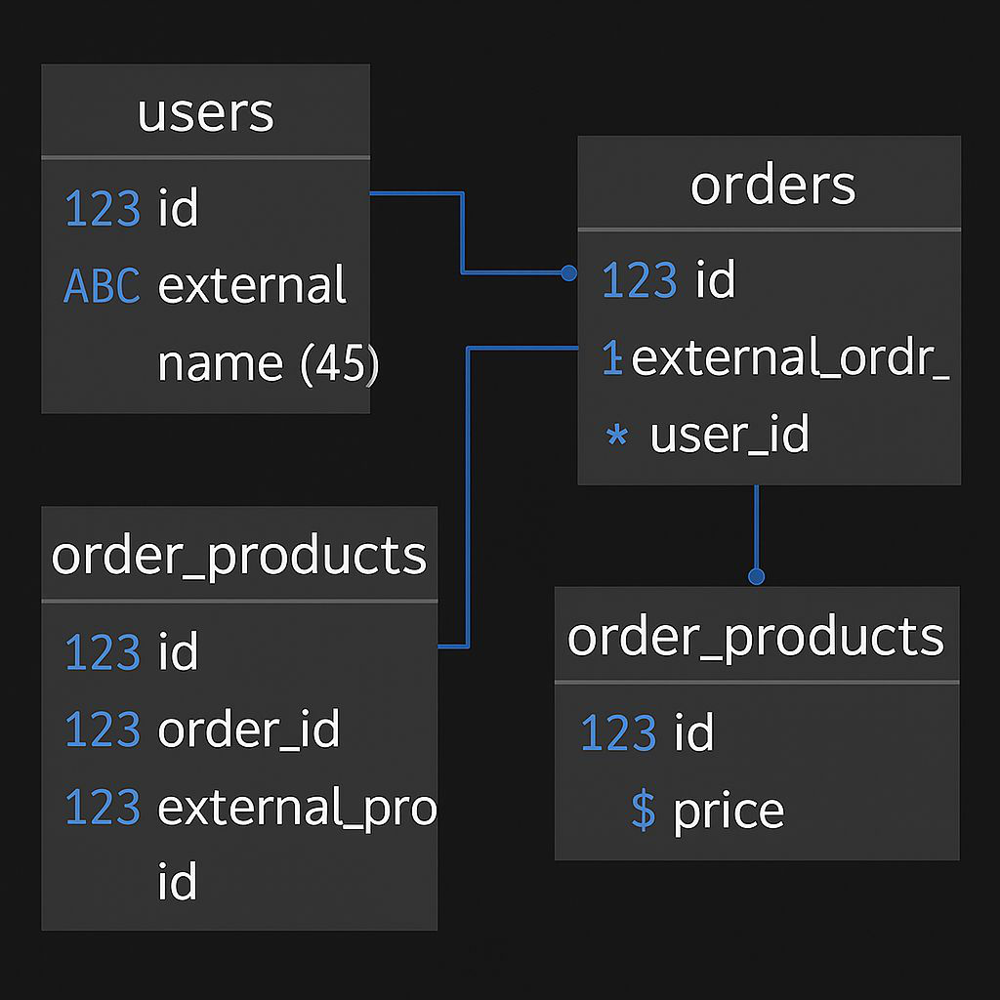

# Desafio LuizaLabs

API REST que recebe arquivos legados com pedidos desnormalizados, processa e retorna os dados em formato JSON normalizado.

---

## 🔧 Tecnologias Utilizadas

- **Python**: Escolhido por sua simplicidade, legibilidade e performance.
- **FastAPI**: Framework leve e moderno, com validação automática de dados e documentação interativa.
- **Uvicorn**: Servidor ASGI rápido e recomendado para aplicações FastAPI.
- **PostgreSQL**: Banco de dados robusto e confiável.
- **SQLAlchemy 2.x**: ORM utilizado para manter o código desacoplado e alinhado com boas práticas.
- **Docker**: Ambiente containerizado para facilitar a execução da aplicação e do banco de dados.

---

## 📁 Estrutura do Projeto

```bash
.
├── samples/            # Arquivos de exemplo
├── src/
│   ├── api/            # Rotas e Controllers (HTTP)
│   │   ├── controllers/
│   │   │   └── formatters/ # Funções auxiliares
│   │   └── utils/      # Validações e handlers
│   ├── core/           # Regras de negócio
│   │   └── order/
│   ├── db/             # Integração com banco (SQLAlchemy)
├── tests/              # Testes automatizados
```

- Models e definições de tabelas estão centralizados em um único arquivo.
- Script `entrypoint.sh` organiza a criação de tabelas e o start do servidor.
- Exceções são tratadas por handlers personalizados.
- Inclui paginação e filtragem por usuário, embora não fosse exigido.

### 📐 Modelagem de Dados



- Campos como `external_id`, `external_order_id` e `external_product_id` foram adicionados para distinguir IDs internos dos externos, facilitando integrações e rastreamento de dados.

---

## 📝 Observações

- Produtos com ID `0` são ignorados, considerando-os inválidos no contexto da aplicação.

---

## 🚀 Como Executar

### Pré-requisitos

- [Docker](https://www.docker.com/)
- [Docker Compose](https://docs.docker.com/compose/)
- [Make](https://www.gnu.org/software/make/) (Linux/macOS)

> 💡 **Windows:** Caso `make` não funcione, use os comandos Docker diretamente ou execute via WSL.

### Comandos

```bash
make start     # Inicia os containers da aplicação
make down      # Para e remove os containers
```

Ou manualmente:

```bash
docker-compose up --build
docker-compose down
```

---

## 📡 Endpoints

- `POST /orders`: Upload do arquivo legado
- `GET /orders`: Lista pedidos (filtros opcionais: `user_id`, `start_date`, `end_date`, `page`)
- `GET /orders/{id}`: Detalhes de um pedido específico

---

## ✅ Checklist

- Upload de arquivo via API  
- Retorno em JSON normalizado  
- Filtros por `order_id`, `user_id` e data  
- Testes automatizados  
- Documentação da API  

---

## 🔭 Melhorias Futuras

- Cache para otimizar performance  
- Testes de ponta a ponta (E2E)  
- Autenticação via token (ex: JWT)  
